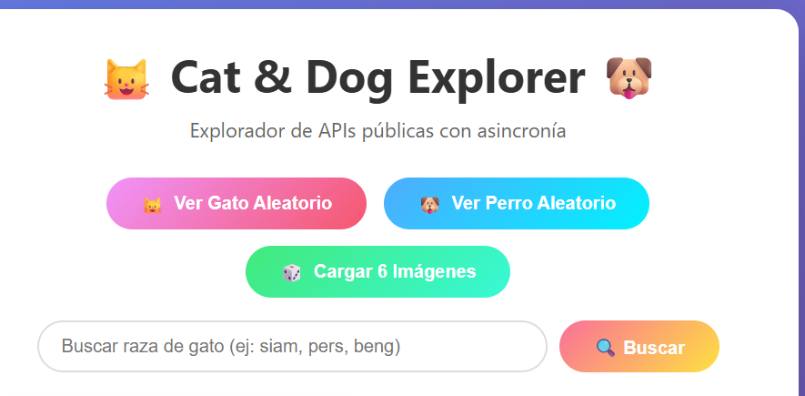
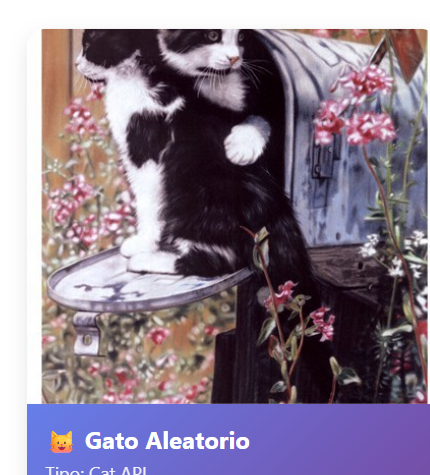
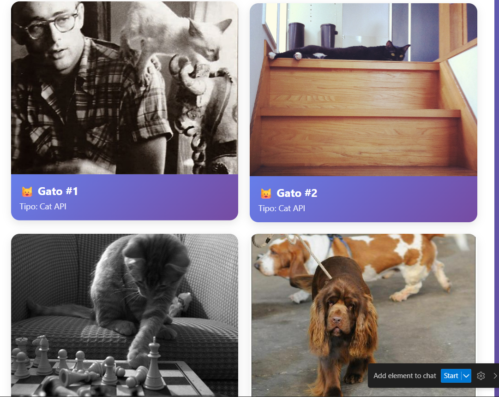

[](https://classroom.github.com/a/NJ448ipO)

# 🐱 Cat & Dog Explorer - Explorador de API con Asincronía

Proyecto interactivo que demuestra el uso de APIs públicas, programación asíncrona en JavaScript y una interfaz de usuario dinámica.

## 📸 Capturas de Pantalla

### Menú Principal


### Gato Aleatorio


### 6 Imágenes Simultáneas


## 🚀 Características

- ✨ **Interfaz moderna y responsiva** con animaciones CSS
- 🔄 **Programación asíncrona** usando `async/await` y `Promise.all()`
- 🌐 **Integración con APIs públicas**:
  - [The Cat API](https://thecatapi.com/) - Para imágenes de gatos
  - [Dog CEO API](https://dog.ceo/dog-api/) - Para imágenes de perros
- 🔍 **Búsqueda de razas** de gatos en tiempo real
- 📊 **Estadísticas** de uso (imágenes cargadas y llamadas a la API)
- 🎲 **Carga múltiple** de imágenes usando `Promise.all()`

## 📋 Funcionalidades

1. **Ver Gato Aleatorio**: Carga una imagen aleatoria de gato
2. **Ver Perro Aleatorio**: Carga una imagen aleatoria de perro
3. **Cargar 6 Imágenes**: Carga 3 gatos y 3 perros simultáneamente usando `Promise.all()`
4. **Buscar por Raza**: Busca y muestra imágenes de una raza específica de gato

## 🛠️ Tecnologías Utilizadas

- **HTML5**: Estructura semántica
- **CSS3**: 
  - Flexbox y Grid Layout
  - Animaciones y transiciones
  - Diseño responsivo
  - Gradientes modernos
- **JavaScript ES6+**:
  - Async/Await
  - Fetch API
  - Promise.all()
  - Manipulación del DOM
  - Event Listeners

## 📦 Estructura del Proyecto

```
03-explorador-de-una-api-asincronia-y-una-ui-interactiva/
│
├── index.html          # Estructura HTML de la aplicación
├── styles.css          # Estilos CSS con diseño moderno
├── app.js             # Lógica JavaScript con asincronía
└── README.md          # Documentación del proyecto
```

## 🚀 Cómo Ejecutar el Proyecto

1. **Clona o descarga** este repositorio
2. **Abre** el archivo `index.html` en tu navegador web
3. **¡Disfruta!** Explora las diferentes funcionalidades

No requiere instalación de dependencias ni servidor backend. Funciona completamente en el navegador.

## 💡 Conceptos Demostrados

### 1. Asincronía con Async/Await

```javascript
async function loadRandomCat() {
    try {
        const response = await fetch(API_URLS.catRandom);
        const data = await response.json();
        // Procesar datos...
    } catch (error) {
        console.error('Error:', error);
    }
}
```

### 2. Promesas Múltiples con Promise.all()

```javascript
const promises = [
    fetch(API_URLS.catRandom).then(r => r.json()),
    fetch(API_URLS.dogRandom).then(r => r.json())
];
const results = await Promise.all(promises);
```

### 3. Manejo de Estados

```javascript
const state = {
    totalImages: 0,
    apiCalls: 0
};
```

### 4. Manipulación Dinámica del DOM

```javascript
function createImageCard(imageUrl, title, type) {
    const card = document.createElement('div');
    card.className = 'image-card';
    // Crear elementos...
    return card;
}
```

## 🎨 Características de UI/UX

- ✅ Indicador de carga animado
- ✅ Manejo de errores con mensajes visuales
- ✅ Animaciones suaves de entrada (fadeIn)
- ✅ Hover effects en tarjetas e imágenes
- ✅ Diseño responsive para móviles
- ✅ Gradientes modernos y coloridos
- ✅ Estadísticas en tiempo real

## 🌐 APIs Utilizadas

### The Cat API
- **Endpoint**: `https://api.thecatapi.com/v1/images/search`
- **Uso**: Obtener imágenes aleatorias y buscar por raza
- **Sin autenticación requerida**

### Dog CEO API
- **Endpoint**: `https://dog.ceo/api/breeds/image/random`
- **Uso**: Obtener imágenes aleatorias de perros
- **Completamente gratuita**

## 🔧 Posibles Mejoras

- [ ] Agregar favoritos (localStorage)
- [ ] Implementar paginación
- [ ] Agregar más APIs (PokeAPI, Rick & Morty, etc.)
- [ ] Sistema de filtros avanzados
- [ ] Modo oscuro
- [ ] Compartir imágenes en redes sociales
- [ ] Descarga de imágenes

## 📝 Notas Técnicas

- Las APIs utilizadas son públicas y gratuitas
- No se requiere API Key para uso básico
- El código usa ES6+ features (asegúrate de usar un navegador moderno)
- Todas las llamadas a la API incluyen manejo de errores

## 👨‍💻 Autor

Proyecto educativo para demostrar:
- Consumo de APIs REST
- Programación asíncrona en JavaScript
- Diseño de interfaces interactivas
- Manejo de estados en aplicaciones web

## 📄 Licencia

Proyecto de código abierto para fines educativos.

---

**¡Diviértete explorando gatos y perros! 🐱🐶**
